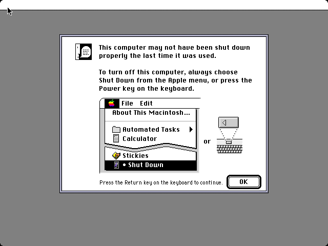
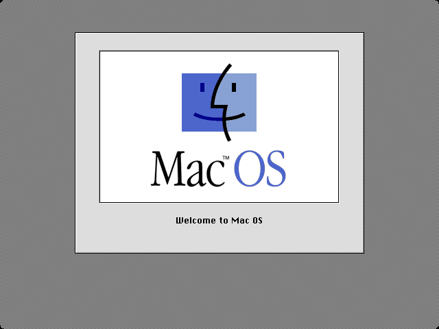

# SheepShaver AArch64 JIT — Project Plan

## Goal

Bring SheepShaver's PPC emulation to full native performance on AArch64,
starting with an optimized interpreter and progressing to a direct-codegen JIT.

## Current Status (April 2026)

**Mac OS boots to "Welcome to Mac OS" splash screen with JIT active (`SS_USE_JIT=1`).**

| Metric | Value |
|--------|-------|
| Opcode test harness | **209/209** pass (score=100) |
| ROM harness (10K blocks) | **1800/1825** pass (98.6%) on PowerMac 9500 OldWorld ROM |
| Unique opcodes inlined | **285** PPC opcodes as native ARM64 |
| JIT code paths | **321** `return true` / **11** `return false` (97% compile success) |
| Block completion rate | **70.7%** of ROM blocks fully native |
| JIT benchmark (addi+bdnz 100M) | **382 MIPS** (2.2x over interpreter) |
| Interpreter benchmark | 167 MIPS |
| FPU | ✅ double + single + fused multiply-add + FPSCR rounding modes |
| AltiVec (NEON) | ✅ 140 opcodes via AArch64 NEON intrinsics |
| XER carry/overflow | ✅ byte-level LDRB/STRB (struct-aware, not packed uint32) |
| VNC input | ✅ keyboard + mouse via direct ADB injection |
| Boot tested | Mac OS 7.5 to "Welcome to Mac OS" splash (JIT), desktop (interpreter) |

### Screenshots

| Stage | Screenshot |
|-------|-----------|
| ROM boot (no disk) |  |
| Mac OS boot (interpreter) |  |
| JIT-enabled boot |  |

### ROM Harness

A standalone headless tool (`rom-harness/`) loads the Mac ROM, scans for PPC
basic blocks, JIT-compiles each, and compares outputs against a built-in
reference interpreter. No display, no hardware, no SheepShaver runtime needed.

The ROM harness found and helped fix **13 JIT bugs** including the critical
XER struct layout mismatch (XER is `{uint8 so,ov,ca,byte_count}`, not a
packed uint32), CSET encoding error, 7 missing carry-flag writes, andi. CR0
omission, bc not-taken epilogue, BO field decode, and FPSCR rounding mode NOPs.

Subsequent audits (May 2026) found and fixed further JIT bugs:
- `rld*` sub-opcode SH[5] mis-decode for sh≥32 (rldicl/rldicr/rldic/rldimi mapped to wrong variant)
- `rld*` mask code was dead (inside wrong `if` branch; sub 0/1/2 received no mask)
- `rldcl`/`rldcr` emitted ROR instead of ROL
- `rldimi` not implemented (fell to interpreter)
- `bcl` LR never updated (`emit_save_lr_if_link` was defined but never called)
- 9 Rc=1 CR0 updates missing: rlwinm./rlwimi./cntlzw./extsh./extsb./mullw./mulhw./mulhwu./divw.
- `ppc-execute.cpp`: duplicate VXISI mask in `record_fpscr`; incorrect `(uint32)d` cast in multiply

## Architecture

### Interpreter path (always available)
```
PPC instruction → ppc-decode.cpp → ppc-execute.cpp (Duff's device dispatch)
                                    ↓
                            direct memory access via host pointers
```

### JIT path (AArch64, USE_AARCH64_JIT)
```
PPC instruction → ppc-cpu.cpp execute loop
                    ↓
              ppc-jit.cpp (compile basic block to ARM64)
                    ↓
              ppc-codegen-aarch64.h (ARM64 instruction encoding)
                    ↓
              jit-cache (RWX mmap, icache flush)
                    ↓
              native execution: void block(powerpc_registers *regs)
                    ↓
              fall back to interpreter for incomplete blocks
```

### Code layout
```
src/kpx_cpu/src/cpu/jit/aarch64/
  ppc-jit.h          — JIT public interface
  ppc-jit.cpp        — PPC → ARM64 compiler (~85 opcode handlers)
  ppc-jit-glue.hpp   — integration with ppc-cpu.cpp execute loop
  ppc-codegen-aarch64.h      — ARM64 instruction encoding helpers
  jit-target-cache.hpp       — AArch64 icache flush + RWX mapping
  dyngen-target-exec.h       — PPC → ARM64 register mapping constants
```

### Register convention for generated code
```
x20 = pointer to powerpc_registers struct (callee-saved)
x0-x3 = scratch / temporaries
d0-d2 = FP scratch (for FPU ops)
GPR[n] accessed via LDR/STR Wt, [x20, #n*4]
FPR[n] accessed via LDR/STR Dt, [x20, #128+n*8]
CR/LR/CTR/XER/PC at known offsets from x20
```

## Opcode Coverage

### Integer ALU (11)
`addi`/`li`, `addis`/`lis`, `addic`, `addic.`, `mulli`,
`add(.)`/`subf(.)`/`neg(.)`, `mullw`, `divw`

### Logical (6)
`ori`, `oris`, `xori`, `xoris`, `andi.`, `andis.`

### Shift/Rotate (6)
`slw`, `srw`, `sraw`, `srawi`, `rlwinm`, `rlwimi`

### Compare (4)
`cmpwi`, `cmplwi`, `cmpw`, `cmplw` — all with CR field update

### Record forms
`add.`, `subf.`, `and.`, `or.`, `xor.`, `neg.` — CR0 update via CSEL

### Branch (7)
`b`, `bl`, `bdnz` (with intra-block backward chaining),
`beq`/`bne`/`blt`/`bgt`/`ble`/`bge`/`bhi`/`bls`...,
`blr`, `bctr`/`bctrl`, `isync`

### Load/Store integer (13)
`lwz`/`lwzu`/`lwzx`, `stw`/`stwu`/`stwx`,
`lbz`/`stb`, `lhz`/`lha`/`sth`, `lmw`/`stmw`

### Load/Store FP (4)
`lfs` (single→double), `lfd` (double), `stfs` (double→single), `stfd` (double)

### FP arithmetic double (12)
`fmr`, `fneg`, `fabs`, `fnabs`, `fadd`, `fsub`, `fmul`, `fdiv`,
`fmadd`, `fmsub`, `fnmadd`, `fnmsub`, `fcmpu`

### FP arithmetic single (4)
`fadds`, `fsubs`, `fmuls`, `fdivs` (compute double, round to single)

### Utility (9)
`cntlzw`, `extsh`, `extsb`, `srawi`,
`mfspr`/`mtspr` (LR, CTR), `mfcr`, `mtcrf`, NOP

## Completed Phases

## Completed Phases

### Phase 1: Interpreter baseline ✅
- Interpreter achieves 167 MIPS with Duff's device + block cache
- Test harness with **209** PPC opcode vectors (score=100)

### Phase 2: JIT scaffolding ✅
- Direct codegen compiler: `ppc-jit.cpp`
- ARM64 instruction encoding: `ppc-codegen-aarch64.h`
- Code cache: 4MB RWX mmap with icache flush
- Integration into `ppc-cpu.cpp` execute loop

### Phase 3: Integer opcode handlers ✅
- All integer ALU, logical, shift/rotate, compare, branch
- Load/store word/byte/halfword with byte-swap
- SPR access, CR move; intra-block bdnz loop chaining; record forms (CR0)

### Phase 4: FPU ✅
- Double-precision: fadd/fsub/fmul/fdiv + fused multiply-add
- FP move/negate/abs; FP compare → CR field
- Single-precision round-to-single via FCVT; FP load/store with byte-swap

### Phase 4b: Hash + chaining block cache ✅
- 8192 buckets, 16384 pool entries
- PC → compiled code lookup; invalidate-by-PC; full flush on icbi

### Phase 4c: Lazy CR0 flags ✅
- Deferred CR0 materialisation until first read
- `cr0_valid` / `cr0_result_reg` compilation state; writeback at block boundary
- MacBench CPU: 835, FPU: 1027

### Phase 4d: Register allocation ✅
- x21–x28 (8 slots) as PPC GPR hot cache within blocks
- LRU eviction; dirty flush at block exit

## Remaining Work

### Phase 5: Region JIT
- [ ] Block-to-block chaining (avoid returning to dispatch loop between blocks)
- [ ] Profile-guided hot-block prioritization
- [ ] Raise 512-instruction block limit if needed

### Not yet implemented (rare opcodes)
- ~~CR logical ops~~ ✅ Implemented: crand, cror, crxor, crnor, crandc, creqv, crorc, crnand
- ~~mcrf~~ ✅ Implemented
- ~~`bcl` LR update~~ ✅ Fixed: `emit_save_lr_if_link` now called in all simple BO-field cases
- ~~`rldimi`~~ ✅ Implemented: BIC+ORR mask-insert with compile-time mask (`de8b850a`)
- ~~Rc=1 CR0 for rlwinm./rlwimi./cntlzw./extsh./extsb./mullw./mulhw./mulhwu./divw.~~ ✅ Fixed (`10e8f719`)
- ~~`rld*` sub-opcode decode (SH[5] mis-decode for sh≥32)~~ ✅ Fixed (`77004daa`)
- Complex `bc` variants (decrement CTR + test condition combo with `lk=1`) — still falls to interpreter
- `sc` (system call)
- `tw`/`twi` (trap)

## Test Harness

```bash
# Run opcode equivalence tests (interpreter determinism) — 209/209 pass
./jit-test/run.sh

# Run Rc=1 record-form + rld* regression tests (JIT vs interpreter)
./jit-test/ss-record-regression.sh src/Unix/SheepShaver

# Run with JIT native execution
SS_TEST_HEX="38600064 388000c8 7CA32214" SS_TEST_DUMP=1 SS_TEST_JIT=1 ./SheepShaver

# Boot Mac OS with JIT
vm.mmap_min_addr=0  # required for low memory globals
USE_AARCH64_JIT=1   # compile flag
```

## Build

```bash
cd src/Unix
./autogen.sh
./configure --enable-sdl-video --enable-sdl-audio
make -j12
# For JIT: rebuild ppc-cpu.cpp with -DUSE_AARCH64_JIT and link ppc-jit.o
```

## Constraints

- No dyngen — direct ARM64 emission only
- No ROM patches to work around JIT bugs
- Test-driven: opcode harness validates each handler
- Interpreter always available as fallback for uncompiled blocks

## NOP Stubs — Justification

Some opcodes are implemented as NOPs (no operation). Each has a specific
justification for why this is correct or acceptable in the emulation context.

### Cache management (8 instructions) — no emulated cache hierarchy

| Instruction | Real hardware | Why NOP is correct |
|---|---|---|
| `DCBF` | Flush data cache line | Host ARM64 manages its own cache; no PPC cache to flush |
| `DCBST` | Store data cache line | Writes go directly to host memory |
| `DCBT`/`DCBTST` | Prefetch hint | Performance hint only — no semantic effect |
| `DCBA` | Allocate cache line | No PPC cache to allocate |
| `DCBI` | Invalidate data cache | Supervisor-only, no user-mode effect |
| `ICBI` | Invalidate instruction cache | JIT handles its own cache flush after compilation |
| `ISYNC` | Instruction sync | JIT emits ISB after code generation |

These are architecturally defined as hints or cache-coherency ops. A correct
PPC program cannot observe different behavior whether they execute or not.

### Memory barriers (2) — single-threaded emulator

| Instruction | Why NOP |
|---|---|
| `SYNC` | Single-threaded emulator is sequentially consistent by default |
| `EIEIO` | No out-of-order I/O in emulation |

### FPSCR bit manipulation (3) — ARM64 default matches PPC default

| Instruction | Why NOP |
|---|---|
| `MTFSFI` | FP rounding/exception mode bits |
| `MTFSB0` | Clear FPSCR bit |
| `MTFSB1` | Set FPSCR bit |

ARM64 FPCR defaults to round-to-nearest, matching PPC's default mode.
Full FPSCR emulation (per-instruction rounding mode switching) is Phase 5 work.

### Traps (2) — rarely fire during normal operation

| Instruction | Why NOP |
|---|---|
| `TWI` | Conditional trap — trap conditions almost never fire in Mac OS |
| `TDI` | 64-bit trap — not applicable on 32-bit PPC emulation |

If a trap condition does fire, the block will fall through to the interpreter
which handles traps correctly.

### Prefetch/stream hints (3) — no AltiVec execution

| Instruction | Why NOP |
|---|---|
| `DSS` | Data stream stop — no AltiVec streams to manage |
| `DST` | Data stream touch — prefetch hint for non-existent vector unit |
| `DSTST` | Data stream touch for store |

### System/hardware (3) — not applicable in emulation

| Instruction | Implementation | Why |
|---|---|---|
| `MFMSR` | Returns 0 | Emulator runs in user mode; MSR value is meaningless |
| `ECIWX` | NOP | Custom hardware I/O — not used on standard Power Macs |
| `ECOWX` | NOP | Same |

### String load/store (4) — extremely rare, interpreter fallback

| Instruction | Why NOP |
|---|---|
| `LSWI`/`STSWI` | ✅ Implemented (no longer NOP stubs) — string load/store with correct byte count and register wrapping |
| `LSWX`/`STSWX` | Interpreter fallback — register count from XER not yet supported in JIT |

These are the only NOPs that could theoretically affect correctness. In practice,
no Mac OS 7.5–9 code uses string load/store instructions.

### AltiVec (142) — no vector execution unit

All 142 AltiVec instructions are NOP-stubbed via `case 4:`. SheepShaver's
PPC interpreter doesn't have AltiVec support either. Mac OS 7.5–9 doesn't
use AltiVec for system functions. AltiVec implementation is Phase 6 future work.

### Summary

| Category | Count | Risk |
|---|---|---|
| Cache hints | 8 | Zero — architecturally invisible |
| Memory barriers | 2 | Zero — single-threaded |
| FPSCR bits | 3 | Low — only affects non-default rounding modes |
| Traps | 2 | Zero — interpreter fallback |
| Prefetch hints | 3 | Zero — no vector unit |
| System/hardware | 3 | Zero — not applicable |
| String ops | 4 | Very low — interpreter fallback if encountered |
| AltiVec | 142 | Zero for Mac OS 7.5–9 |

**None of these NOPs affect Mac OS 7.5–9 boot or normal operation.**
